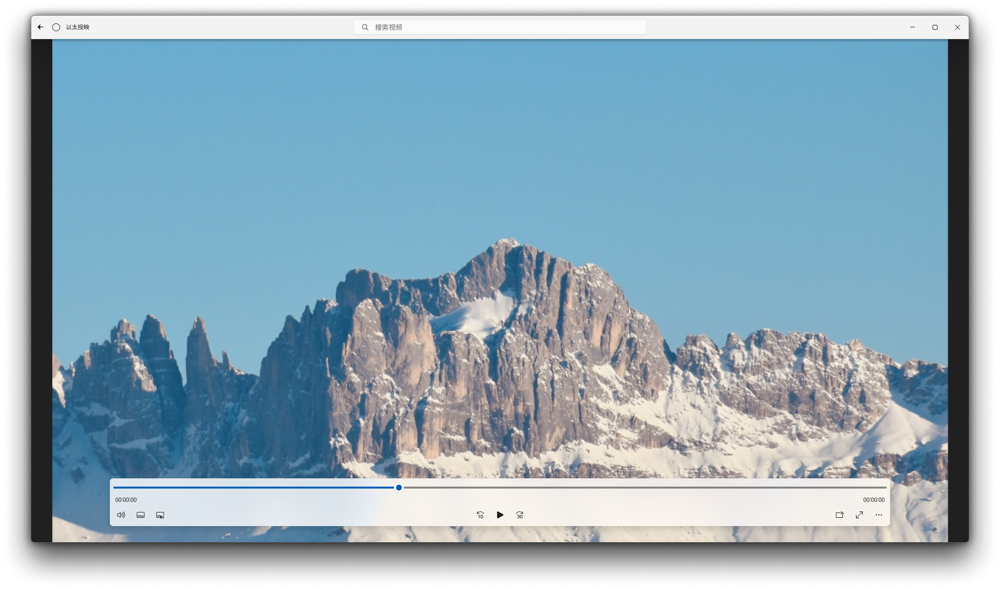

# AetherCast

## 概述
一个现代视频播放器应用。基于`C#` 与 `Win UI 3`。
这是一个个人学习项目，用于练习和提升 C# / Windows App SDK 开发技能。

## 预览

## 安装
- 系统要求：
    - Windows 10版本1809 (Build 17763.0) 及以上
    - 兼容的X86-64 / ARM64处理器
### 侧载
1. 打开系统设置，依次选择 `系统` -> `开发者选项`，打开 `开发人员模式`。滚动到页面底部，展开 `PowerShell` 区块，开启 `更改执行策略...` 选项
2. 自 [Release](https://github.com/YAlexius/AetherCast/releases/) 页面下载最新版本应用包
3. 解压后使用Windows Powershell运行`Install.ps1`
### 自Windows应用商店安装
- 待实现

## 功能
- 基础视频播放
- 待实现：
    - 弹幕功能
    - 视频库、播放列表功能
